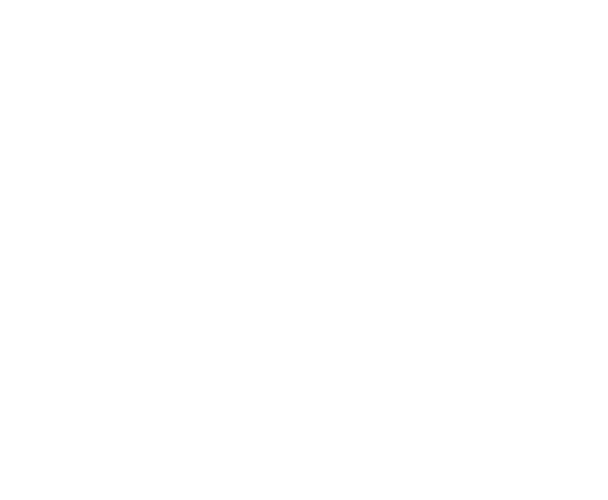

# Lune Brew — Deck Building Guide for AI Agents

> **Purpose.** A machine-followable specification for building presentation decks in the Lune Brew brand, tuned for **technical & academic content** — research papers, data, charts, figures, pipelines, code snippets, and detailed explanation. Follow it literally: exact colours, fonts, sizes, spacing, and per-slide recipes are given.
>
> **Audience.** An AI coding/authoring agent (e.g. Claude Code) generating decks as HTML/CSS (recommended) or `.pptx`.
>
> **Companion file.** A rendered visual reference exists as `LuneBrew_Brand_and_Deck_Guide.html`. This markdown is the buildable version of the same system.
>
> **Brand kit (ship alongside this file).** `assets/logo-black.svg` · `assets/logo-white.svg` · `assets/logo.svg` (currentColor) · `assets/logo-black.png` · `assets/logo-white.png` · `assets/lunebrew-tokens.css` (import first) · `assets/lunebrew-motifs.html` (copy-paste snippets). Inject the logo from these files — do not redraw it.

---

## 0. Prime directives (read first, in priority order)

1. **Function over decoration.** Every element must earn its place by serving comprehension. If a shape, colour, or animation does not help the audience understand the content, delete it. This overrides all aesthetic rules below.
2. **Assertion–evidence, not topic–bullets.** Each content slide's headline is a **full-sentence claim** (the finding), and the slide body is the **visual evidence** for it (chart, figure, table, diagram). Avoid decks that are walls of bullets. (See §11.)
3. **Brand must stay instantly recognisable.** Even the densest data slide carries **at least one brand marker** from the motif kit (§3). The recognisability comes from the *system* — Ink+Paper+Gold, condensed caps headlines, the wave/pill/card devices — not from covering content in ribbons.
4. **Contrast and legibility are non-negotiable.** Reading text is only ever Ink-on-light or White-on-Ink. Accent colours are for shapes, fills, and highlights — never small body text on a light background (§13).
5. **One idea per slide. One accent per slide.** If a slide needs two ideas, it is two slides.

**Conflict rule:** when brand style and clarity collide, clarity wins — but solve it by *restraining* the brand marker (shrink it, move it to a corner), not by dropping the brand entirely.

---

## 1. Design tokens

Copy these verbatim. HTML values are CSS; PPTX values are for a 13.333 in × 7.5 in (16:9) slide.

### 1.1 Colour

```css
:root{
  /* CORE — on every slide */
  --ink:      #111111;  /* primary dark: backgrounds, body text, cards       */
  --ink-2:    #1D1D1B;  /* raised panels / code blocks on dark               */
  --paper:    #EFF0EB;  /* primary light background (warmer than white)      */
  --white:    #FFFFFF;  /* ribbon, reversed text, data-slide backgrounds     */
  --gold:     #E5A83D;  /* THE accent: highlights, LB pill, hero data series */

  /* NEUTRALS — structure & de-emphasis */
  --grey:     #8A8A86;  /* secondary text on light, muted data series        */
  --grey-2:   #5C5C58;  /* captions on light                                 */
  --line-l:   rgba(17,17,17,.12);   /* hairlines / gridlines on light        */
  --line-d:   rgba(255,255,255,.14);/* hairlines / gridlines on dark         */

  /* FLAVOUR ACCENTS — pick ONE per deck (or per section) */
  --choc:  #3F2C1B;   --pine:  #E9B028;   --mango: #E18200;
  --teal:  #2F9C96;   --lime:  #A7C520;   --ruby:  #C0392B;
}
```

**Roles**

| Token | Role | Never |
|---|---|---|
| `--ink` | default dark bg, body text, cards | tint it blue/grey |
| `--paper` | default light bg | replace with pure white for whole slides (use white only for data) |
| `--gold` | THE signature accent + the hero data series | large flat fills of body area; small text on paper |
| flavour accent | one per deck; section colour + secondary data series | mixing >1 on a slide |

### 1.2 Typography

| Role | Font (free stand-in) | Fallback stack | Style |
|---|---|---|---|
| Display | **Poppins** 700 | `system-ui, sans-serif` | rounded geometric; brand moments only |
| Headline | **Archivo Narrow** 700 | `'Arial Narrow', system-ui` | **UPPERCASE**, condensed — the "product-name" voice |
| Body | **Inter** 400/500 | `system-ui, sans-serif` | quiet, readable |
| Meta / label | **Inter** 600 | — | small, `letter-spacing:.20em`, UPPERCASE |
| Code | **JetBrains Mono** 400/600 | `'IBM Plex Mono', ui-monospace, monospace` | ligatures on |

```css
@import url('https://fonts.googleapis.com/css2?family=Poppins:wght@400;600;700&family=Archivo+Narrow:wght@600;700&family=Inter:wght@400;500;600&family=JetBrains+Mono:wght@400;600&display=swap');
```

> If the brewery's true brand fonts are known, substitute Display+Headline with them; keep Inter/JetBrains Mono for body/code.

### 1.3 Type scale

| Element | PPTX (pt) | HTML @1280×720 (px) | Font role |
|---|---|---|---|
| Cover/display title | 44–54 | 56–72 | Display or Headline |
| Slide headline (assertion) | 26–32 | 34–42 | Headline (caps) **or** Display for sentence-case assertions |
| Subhead | 18–20 | 24–26 | Body 600 |
| Body | 15–17 | 18–20 | Body 400 |
| Caption / axis label | 11–12 | 13–14 | Body 400 |
| Meta caps | 9–10 | 11–12 | Meta |
| Code | 13–15 | 15–17 | Mono |

> **Assertion headline exception:** a full-sentence finding reads better in **Display/Poppins sentence case** than in condensed caps. Use condensed caps for *labels* (section names, "METHODOLOGY", product-style titles); use Poppins for *sentences*. Lift the key word in `--gold`.

### 1.4 Spacing, grid, geometry

```
Slide safe margin:   6–8%  (PPTX ≈ 0.8 in;  1280px ≈ 80px)
Grid:                12 columns, gutter 2% (≈ 24px @1280)
Baseline rhythm:     8px unit (all spacing = multiples of 8)
Card radius:         16–24px   (PPTX ≈ 0.2 in)
Pill radius:         999px (fully round)
Stadium band stroke: 8–12px
Max body measure:    ~60ch  (never full-bleed paragraphs)
```

---

## 2. Output medium & build notes

- **Preferred: HTML/CSS**, one slide = one `section.slide` with `aspect-ratio:16/9`. Motifs are SVG/CSS and render crisply; export to PDF via headless Chromium. Use `reveal.js` or a plain scroll-snap deck.
- **PPTX:** use the `pptx` skill. Map tokens to theme colours; set slide size 13.333×7.5 in; embed the wave/pill/band as vector shapes or pre-rendered SVG→PNG. Keep code as real text in a mono font (not screenshots) where possible.
- **Never** rasterise text, charts, or code you could keep as vector/live text. Screenshots of code/charts are a last resort and must be ≥2× resolution.

---

## 3. The motif kit (brand markers)

These five devices are the brand's handwriting. **Rule: ≥1 marker per slide.** The table sets *how much* marker each slide density allows, so markers never fight the content.

| Slide density | Required marker (minimum) | Allowed extras | Forbidden |
|---|---|---|---|
| **Hero/dark** (title, section, statement, close) | full **ribbon** or **stadium band** | LB pill, big logo | — |
| **Working/light** (content, results) | small **logo** (corner) **+** one **wave divider** or **LB pill** | one tab-card callout | large ribbon over text |
| **Data/figure/code** (max density) | small **logo** + **LB pill** section tag **or** a single **wave** rule | tab-card for the "so what" | ribbon/band across the plotting area |

### 3.1 The Lune ribbon (river swoosh) — hero device

```html
<svg class="ribbon" viewBox="0 0 1280 720" preserveAspectRatio="xMidYMid slice" aria-hidden="true">
  <path d="M-40 470 C 260 470 320 210 600 210 C 880 210 940 520 1240 520"
        fill="none" stroke="#FFFFFF" stroke-width="70" stroke-linecap="round" opacity=".06"/>
  <path d="M-40 440 C 280 440 330 170 620 170 C 900 170 960 470 1300 450"
        fill="none" stroke="#E5A83D" stroke-width="10" stroke-linecap="round" opacity=".55"/>
</svg>
```
Use **one** ribbon per slide, on hero/dark slides. Behind data: only the faint white ghost stroke at ≤6% opacity, never the gold line across a chart.

### 3.2 The stadium band — section framing

```html
<div class="stadium"><!-- thick rounded-rect "U", open to one side -->
  <div class="anchor">LUNEBREW</div>
</div>
<style>
.stadium{width:66%;height:70%;border:10px solid var(--gold);border-radius:999px;position:relative}
.stadium .anchor{position:absolute;left:8%;bottom:10%;background:var(--ink);color:#fff;
  border-radius:12px;padding:6px 14px;font:700 15px/1 'Poppins'}
</style>
```

### 3.3 The tab / label card — the "so what" container

```html
<div class="tabcard">
  <div class="r1"><span>◷ LB · 04</span><span>KEY RESULT</span></div>
  <div class="r2">+62%</div>
  <div class="r3"><span>throughput vs baseline</span><span class="tag">p&lt;0.01</span></div>
</div>
<style>
.tabcard{background:var(--ink);color:#fff;border-radius:22px;padding:18px 20px;max-width:280px}
.tabcard .r1{display:flex;justify-content:space-between;font:600 10px/1 'Inter';
  letter-spacing:.14em;text-transform:uppercase;color:rgba(255,255,255,.55)}
.tabcard .r2{font:700 40px/1 'Archivo Narrow';text-transform:uppercase;margin:8px 0;color:var(--gold)}
.tabcard .r3{display:flex;justify-content:space-between;align-items:center;
  border-top:1px solid rgba(255,255,255,.18);padding-top:10px;font:500 13px/1.3 'Inter'}
.tabcard .tag{color:var(--gold);font-size:11px;letter-spacing:.1em;text-transform:uppercase}
</style>
```
Reuse for: the headline stat, a definition, a callout, an equation result, a code output. It is the brand's default "highlight box".

### 3.4 The LB pill — section/slide numbering

```html
<span class="lbpill"><span class="k">LB</span><span class="n">04</span></span>
<style>
.lbpill{display:inline-flex;border:1.6px solid currentColor;border-radius:999px;overflow:hidden;
  font:700 12px/1 'Inter';letter-spacing:.06em;align-items:stretch}
.lbpill span{padding:6px 11px;display:flex;align-items:center}
.lbpill .n{border-left:1.6px solid currentColor;color:var(--gold)}
</style>
```
On decks the number = **section index** (LB 01, LB 02…) or figure/table ID (LB · F3). This is the cheapest brand marker for dense slides — use it as the persistent section tag in a corner.

### 3.5 Wave divider + monoline icons

```html
<!-- wave rule: use as a section underline or corner mark -->
<svg width="72" height="20" viewBox="0 0 72 20" aria-hidden="true">
  <path d="M2 10 q 7 -8 14 0 t 14 0 t 14 0 t 14 0" fill="none"
        stroke="#E5A83D" stroke-width="3" stroke-linecap="round"/>
</svg>
```
Icons are **single-weight, never filled**, 2–2.4px stroke, round caps. Use them as quick keys (dataset, method, result), not decoration. One weight, one size family per deck.

### 3.6 Persistent chrome (put on every working slide)

- **Top-left or top-right:** small logo (white on ink / black on paper), height ≈ 3–4% of slide.
- **Opposite top corner:** LB pill with the section number.
- **Bottom:** thin meta line — `SHORT DECK TITLE · SECTION · ##` in meta caps, plus page number.
This chrome alone keeps every slide branded, freeing the content area to be all-business.

---

## 4. Layout system

- 12-col grid, 6–8% margins, 8px baseline.
- **Reading order anchor:** headline top-left; supporting visual dominant-right or full-width below.
- **Dominant visual gets ≥55% of the content area** on data/figure slides.
- Keep a persistent footer band (meta line + page no.) at the same y on every slide.
- **Rhythm:** alternate dark hero slides (title, section, statement, close) with light working slides (content, data, code). Never >3 consecutive dark or light slides in a technical talk — it flattens emphasis.

---

## 5. Data & charts

Charts are the point, not the backdrop. Style them as first-class, legible, brand-tied objects.

### 5.1 Chart colour mapping

- **Hero / "the answer" series → `--gold` (#E5A83D).** The one series the slide is about is always gold.
- **Baseline / "everything else" → `--grey` (#8A8A86)** (or `--ink` on white). De-emphasise non-focal series to grey so gold pops.
- **Categorical palette (when several series matter), in order:**
  `#E5A83D` (gold) → `#2F9C96` (teal) → `#C0392B` (ruby) → `#E18200` (mango) → `#A7C520` (lime) → `#3F2C1B` (choc) → `#8A8A86` (grey).
- **Sequential (heatmaps / intensity):** ramp Paper `#EFF0EB` → Gold `#E5A83D` → Choc `#3F2C1B`.
- **Diverging:** Teal `#2F9C96` ↔ neutral `#EFF0EB` ↔ Ruby `#C0392B`.
- Max **6 categorical series**; beyond that, group into "Other" (grey) or switch chart type.

### 5.2 Chart styling rules

- **Background:** white (`#FFFFFF`) for data slides — maximum contrast. Ink text `#111`.
- **Gridlines:** hairline only, `--line-l`; drop the y-grid if you can direct-label.
- **Axes:** single ink baseline (x), no chart junk, no 3D, no drop shadows, no gradients on bars.
- **Direct-label the series** at the line end / bar top instead of a legend where possible.
- **Annotate the insight on the chart** — an arrow or a gold marker + short note pointing at the exact finding.
- **Numbers:** consistent decimal places; thousands separators; units in the axis title, not every tick.
- **Bars:** flat fill, 2–4px top radius max; gap ≈ 40% of bar width.
- **Lines:** 3px; hero line gold + thicker (4px); markers only at data points that matter.
- **Source line:** every data slide ends with a meta-caps line: `SOURCE: <dataset/paper>, n=<N>` bottom-left.

### 5.3 Chart do / don't

| Do | Don't |
|---|---|
| Gold = the series you're arguing about | rainbow every series |
| Direct labels + on-chart annotation | force the reader to decode a legend |
| One chart per slide (usually) | 4 tiny charts nobody can read (use a figure-grid slide, §11) |
| Title = the finding ("Throughput rose 62%") | title = the axis ("Throughput over time") |
| Keep axes honest (zero baseline for bars) | truncate axes to exaggerate |

---

## 6. Figures, images & diagrams

- Frame a figure in a **tab-card** (ink, rounded) or inside the **stadium band** to brand it without touching the figure itself.
- **Caption** below in meta caps: `FIG 3 · <one-line description>`. Optional gold "FIG 3" LB-pill.
- Give the figure ≥55% of the content area; the assertion headline does the talking above it.
- Photos/renders: full-bleed is fine on hero slides; on working slides, keep a paper or ink panel behind any overlaid text (never text directly on a busy image).
- Vector diagrams inherit tokens: ink strokes, gold for the focal element, grey for context.

---

## 7. Code snippets

Code is content — keep it real text, styled, and readable from the back row.

- **Container:** ink card (`--ink-2` #1D1D1B), radius 16–20px, padding 20–24px, subtle `--line-d` border.
- **Font:** JetBrains Mono, 13–15pt (PPTX) / 15–17px (HTML), line-height 1.5.
- **Show only the lines that matter.** Elide the rest with `# …` / `// …`. Never paste a whole file.
- **Syntax palette on ink** (brand-tied, high-contrast):

  | Token | Colour |
  |---|---|
  | base text | `#EDEDE9` |
  | comment | `#8A8A86` (grey, italic) |
  | keyword | `#E5A83D` (gold) |
  | string | `#A7C520` (lime) |
  | function / def | `#2F9C96` (teal) |
  | number / constant | `#E18200` (mango) |
  | operator / punctuation | `#C9C9C4` |

- **Highlight the focal line(s)** with a left gold bar + 8% gold row tint; dim the rest to ~70% opacity.
- **Caption / output:** put the result in a **tab-card** beside or below (`>>> 0.94 accuracy`).
- **Filename / lang tag** top-right of the card in meta caps (`train.py · PYTHON`).

```html
<figure class="code">
  <div class="hd"><span>train.py</span><span>PYTHON</span></div>
<pre><code><span class="cm"># fit the model</span>
<span class="kw">def</span> <span class="fn">train</span>(X, y):
    model = GradientBoosting(<span class="num">n_estimators=300</span>)
    <span class="hl">model.fit(X, y)</span>          <span class="cm"># focal line</span>
    <span class="kw">return</span> model
</code></pre>
</figure>
<style>
.code{background:#1D1D1B;border:1px solid rgba(255,255,255,.14);border-radius:18px;overflow:hidden;color:#EDEDE9;font:400 15px/1.5 'JetBrains Mono',monospace}
.code .hd{display:flex;justify-content:space-between;padding:10px 18px;color:#8A8A86;
  font:600 11px/1 'Inter';letter-spacing:.14em;text-transform:uppercase;border-bottom:1px solid rgba(255,255,255,.1)}
.code pre{margin:0;padding:18px 22px}
.code .cm{color:#8A8A86;font-style:italic}.code .kw{color:#E5A83D}.code .fn{color:#2F9C96}
.code .num{color:#E18200}.code .hl{background:rgba(229,168,61,.10);box-shadow:inset 3px 0 0 #E5A83D;display:inline-block;width:100%}
</style>
```

---

## 8. Equations & math

- Render with LaTeX (MathJax/KaTeX in HTML; native equation or high-res image in PPTX).
- Ink on paper, or white on ink. **Colour only the term you're explaining** in gold; keep the rest ink/white.
- Define every symbol once, in a small meta-caps legend beside the equation, or via callouts.
- Big single equations get the hero treatment: centred, large, one gold-highlighted term, one-line assertion headline above ("The loss penalises both error and complexity").

---

## 9. Process, pipeline & architecture diagrams

For methodology / systems slides:

- **Nodes:** rounded-rect cards (radius 16px). Neutral nodes = ink outline on paper (or ink fill on dark); **the focal/novel stage = gold fill** (or gold outline + gold label).
- **Edges:** 2px ink arrows; round joins; label edges with meta caps.
- **Flow direction:** left→right or top→down, consistent. Number stages with **LB pills** (LB 01 → LB 02 → LB 03) to brand the diagram natively.
- **Wave connector option:** the Lune wave can double as a "data flows through" connector between two stages — a rare case where a motif *is* the function.
- Keep ≤7 nodes per view; deeper detail → a follow-up zoom slide.

---

## 10. Tables

- Header row: ink fill, white text, meta caps.
- Body: paper/white, ink text; zebra with `--line-l` at 50% only if >6 rows.
- **Highlight the winning row/cell** with an 8% gold tint + gold left bar.
- Right-align numbers, align decimals, one unit statement in the header.
- Max ~6 columns / ~8 rows visible; overflow → appendix.

---

## 11. Template library

Each template lists: **purpose · background · layout · required elements · brand marker**. Sentence-case assertion headlines unless marked "label".

> **Assertion–evidence reminder:** for every CONTENT/RESULTS/FIGURE/DATA/CODE slide, write the headline as the *conclusion*, then show the evidence. Bulleted "topic" slides are the exception, not the default.

### A. Framing slides (hero/dark)

**A1 · Title / cover**
Purpose: open. BG: `--ink`. Layout: white logo top-left; big Display/Headline title bottom-left; gold ribbon; subtitle in meta caps (venue · date · authors). Marker: ribbon + logo.

**A2 · Authors / affiliation** (academic)
Purpose: credit + context. BG: ink. Layout: title of work (Headline caps) top; author list with affiliations as small tab-cards or a clean grid; venue LB-pill. Marker: LB pill + wave.

**A3 · Agenda / roadmap**
Purpose: map the talk. BG: paper. Layout: numbered list using LB pills (LB 01…LB 0n) each with a 3–5 word label (condensed caps); a thin wave spine connecting them. Marker: LB pills.

**A4 · Section divider**
Purpose: gear change. BG: **the one flavour accent** full-bleed. Layout: white stadium band right; LB-pill section number top-left; condensed-caps section title bottom-left. Marker: stadium band + pill.

### B. Setup slides (light)

**B1 · Context / motivation**
Purpose: why this matters. BG: paper. Assertion headline; one supporting visual (photo in tab-card / single stat). Marker: logo + wave.

**B2 · Problem / gap** (academic)
Purpose: the gap in prior work. Layout: 2-col — "What exists" (grey) vs "What's missing" (gold callout tab-card). Marker: tab-card.

**B3 · Research question / hypothesis** (label headline OK)
Purpose: state RQ/H. BG: ink. Layout: the question centred in Display, key term in gold; optional H1/H2/H3 as stacked LB-pill rows. Marker: pill + ribbon (faint).

**B4 · Related work / literature**
Purpose: position the work. Layout: compact table or 3-column card set (Approach · Limitation · Ours-in-gold). Keep to the 3–5 works that matter. Marker: logo + wave; winning row gold-tinted.

**B5 · Contributions** (label or assertion)
Purpose: what's new. Layout: 3 numbered tab-cards (LB pills), each a one-line contribution, focal verb in gold. Marker: pills + cards.

### C. Method slides

**C1 · Methodology overview / pipeline** → use §9. BG: paper (or ink). Stages as LB-pill-numbered nodes; novel stage gold. Marker: native (pills in diagram).

**C2 · Dataset card**
Purpose: describe the data. Layout: a large tab-card with meta rows (N, features, source, split) + one small distribution chart. Meta-caps `SOURCE:` line. Marker: tab-card.

**C3 · Algorithm / equation** → §8. Marker: gold-highlighted term + assertion headline.

**C4 · Code snippet** → §7. Assertion headline states what the code *achieves*, not "here is the code". Marker: filename tag + output tab-card.

**C5 · Experimental setup**
Purpose: reproducibility. Layout: 2-col spec list (hardware, hyper-params, baselines) in mono/Inter; keep tokens tidy. Marker: logo + pill.

### D. Evidence slides (the core)

**D1 · Single hero chart** → §5. BG: white. Assertion headline = the finding; gold = the series in question; on-chart annotation; source line. Marker: logo + pill (corner) + optional wave. **The workhorse slide.**

**D2 · Chart + interpretation**
Layout: chart left (≥55%), a tab-card right holding the "so what" (the number, the p-value, the effect size). Marker: tab-card.

**D3 · Figure spotlight** → §6. One figure, framed, captioned `FIG n`. Marker: LB-pill figure ID.

**D4 · Figure / chart grid (small multiples)**
Purpose: compare many conditions. Layout: 2×2 or 1×3 aligned panels, **shared axes & scale**, shared legend once, consistent gold-focal. Caption each panel. Only when panels are individually legible. Marker: logo + pill.

**D5 · Comparison / ablation table** → §10. Winning row gold. Assertion headline states the takeaway. Marker: gold-tinted row.

**D6 · Before / after** (or baseline vs ours)
Layout: split slide; left grey (baseline), right gold (ours); same chart type & scale both sides; delta called out in a centre tab-card. Marker: tab-card.

**D7 · Results summary**
Purpose: consolidate. Layout: 3–4 headline metrics as tab-cards in a row (each: big gold number + label + significance tag). Marker: card row.

### E. Meaning slides

**E1 · Key takeaway / statement**
BG: ink. One sentence in Display, key word gold; "— KEY FINDING" meta caps. Marker: ribbon (faint) + gold word.

**E2 · Quote**
BG: ink. Oversized quote, attribution in meta caps. Marker: gold quotation accent + wave.

**E3 · Limitations / threats to validity** (academic)
Layout: honest 2–3 item list; each item ink, mitigation in gold. No gloss. Marker: logo + wave.

**E4 · Future work**
Layout: LB-pill roadmap (LB 01…) of next steps. Marker: pills.

### F. Closing slides

**F1 · References / citations**
BG: paper. Layout: compact numbered list, Inter 12–13px, hanging indent; DOIs/links in grey; can span 2 columns. Marker: small logo + wave (minimal — legibility first).

**F2 · Acknowledgements**
BG: ink or paper. Logos/names in a tidy grid. Marker: logo.

**F3 · Closing / thanks + contact**
BG: ink. Centred white logo; tagline **"Brewed in the Lune Valley"** in gold meta caps; contact / repo / paper URL in meta caps below. Marker: logo + tagline.

**F4 · Appendix / backup divider**
BG: flavour accent (dimmed). "APPENDIX" condensed caps + stadium band. Marker: band. (Backup slides follow, styled as D/C templates.)

### Template selection cheat-sheet

```
Opening a talk?            → A1 (+A2 authors, A3 agenda)
Changing topic?            → A4 section divider
Explaining why/what-gap?   → B1/B2/B3
Positioning vs others?     → B4/B5
Showing how it works?      → C1 pipeline / C3 equation / C4 code / C2 dataset
Showing that it works?     → D1 hero chart (default) → D2/D5/D6/D7 as needed
Comparing many things?     → D4 grid / D5 table
Saying what it means?      → E1 takeaway / E3 limitations / E4 future work
Ending?                    → F1 refs → F3 close
```

---

## 12. Explanatory density (making slides that teach)

The user's decks must *explain in detail* — build slides that carry the argument, not placeholders:

- **Headline carries the claim.** The audience should get the point from the headline + visual alone.
- **Annotate, don't just display.** Put the interpretation *on* the chart/figure (arrow + note at the exact evidence).
- **Layer complex slides** — if building interactively, reveal in steps (context → data → highlight → conclusion) so nothing lands as a wall.
- **Pair every figure with a one-line takeaway** (assertion headline or a tab-card).
- **Define terms in place** with small callouts rather than assuming.
- **Speaker-notes:** generate detailed notes per slide (what each axis/term/line means, why it matters, the transition) — the deck is the evidence, the notes are the full explanation. (If producing a talk, the `wip-technical-briefing` skill pairs a deck with a teaching-level script — a good fit here.)

---

## 13. Accessibility & contrast (hard rules)

- Reading text: **Ink on Paper/White** or **White on Ink** only. Target WCAG **AA ≥ 4.5:1** (large text ≥ 3:1).
- Gold `#E5A83D` on white ≈ 1.9:1 — **fails** for text; use gold only for fills/shapes/large numbers on ink, or as an underline/marker, never small body text on light.
- Never encode meaning by colour alone — add labels, patterns, or direct annotation (colour-blind safe).
- Min on-screen sizes: body ≥ 15pt, captions ≥ 11pt, no critical text < 11pt.
- Charts: distinguish series by label + position, not hue alone.

---

## 14. Pre-flight checklist (agent self-check before export)

```
[ ] Every slide has ≥1 brand marker (logo/pill/wave/card/ribbon) per §3 density table
[ ] Persistent chrome present: small logo + LB-pill section no. + footer meta line + page no.
[ ] Exactly ONE flavour accent used across the deck (or one per section)
[ ] Gold reserved for THE focal thing on each slide (one hero item)
[ ] Content headlines are assertions (findings), not topic labels
[ ] Each chart: hero series gold, others grey/neutral, direct-labelled, source line present
[ ] Charts/tables honest (zero baseline for bars, no truncation)
[ ] Code kept as real mono text, focal line highlighted, output in a tab-card
[ ] Reading text is ink-on-light or white-on-ink only; AA contrast passes
[ ] Dark/light rhythm alternates; no >3 same-density slides in a row
[ ] Fonts: Poppins/Archivo Narrow/Inter/JetBrains Mono (or approved brand fonts)
[ ] 6–8% margins, 8px baseline, one idea per slide
[ ] Closing slide: white logo + "Brewed in the Lune Valley" + contact/URL
[ ] No default office template, clip-art, 3D, gradients-on-bars, or filled monoline icons
```

---

## 15. Minimal reusable skeletons

**Deck base (HTML)**

```html
<section class="slide dark">      <!-- or .light / .data -->
        <!-- swap to black on light -->
  <span class="chrome-pill lbpill"><span class="k">LB</span><span class="n">04</span></span>
  <!-- slide content per template -->
  <footer class="chrome-meta">DECK TITLE · METHODOLOGY · 04</footer>
</section>
```

```css
.slide{aspect-ratio:16/9;position:relative;padding:7% 8%;overflow:hidden;font-family:'Inter',system-ui}
.slide.dark{background:var(--ink);color:#fff}
.slide.light{background:var(--paper);color:var(--ink)}
.slide.data{background:#fff;color:var(--ink)}
.chrome-logo{position:absolute;top:4%;left:8%;height:4%}
.chrome-pill{position:absolute;top:5%;right:8%}
.chrome-meta{position:absolute;left:8%;bottom:4%;font:600 11px/1 'Inter';
  letter-spacing:.2em;text-transform:uppercase;color:var(--grey)}
h1.assert{font:700 38px/1.05 'Poppins';letter-spacing:-.01em;max-width:22ch}
h1.assert b{color:var(--gold)}
h1.label{font:700 34px/1 'Archivo Narrow';text-transform:uppercase}
```

---

### Summary of what makes it Lune Brew *and* rigorous

Ink + Paper + **one** flavour accent · condensed-caps or Poppins **assertion** headlines · the **motif kit** (ribbon, stadium band, tab-card, LB pill, wave) present but sized to the slide's job · **gold = the one thing that matters** on every chart, equation, and diagram · everything else in service of the argument, nothing decorative.
